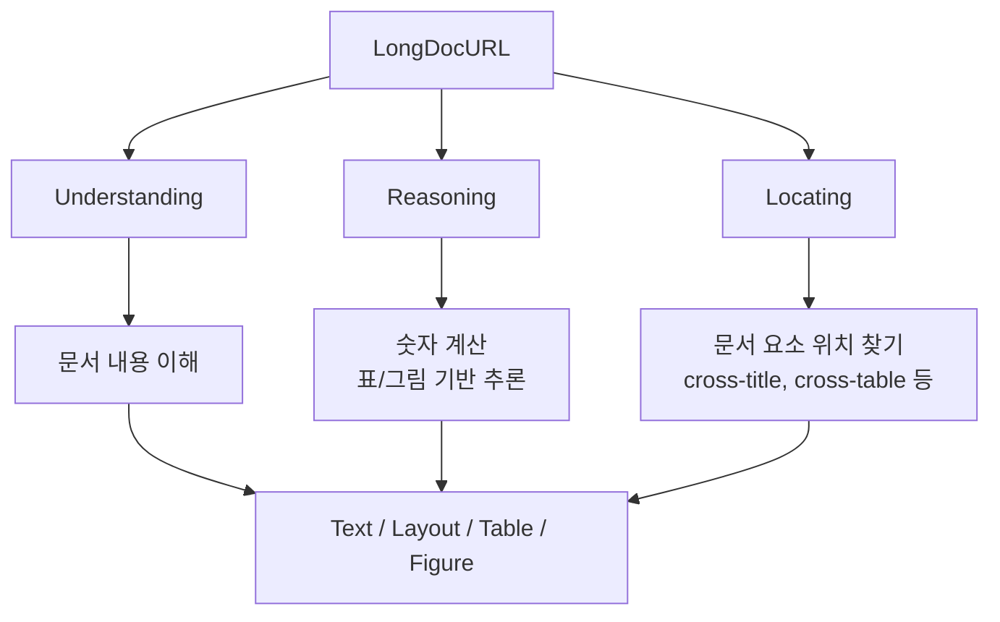
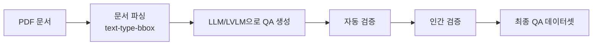
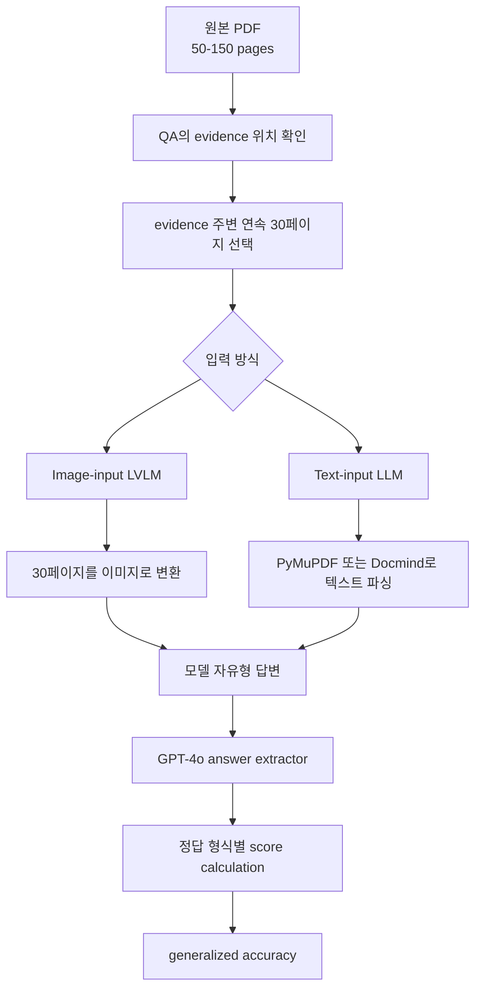

# LongDocURL 한국어 상세 노트

원문: https://arxiv.org/abs/2412.18424  
HTML: https://ar5iv.labs.arxiv.org/html/2412.18424v3  
프로젝트/코드: https://github.com/dengc2023/LongDocURL  
작성일: 2026-04-29

주의: 이 파일은 논문 HTML 전체의 직역이 아니라, 논문 내용을 한국어로 재구성한 상세 해설 노트다. 원문 전체 번역이 필요한 경우에는 사용자가 제공한 PDF/HTML 파일을 기준으로 별도 작업해야 한다.

## 한 줄 요약

LongDocURL은 긴 문서에서 understanding, numerical reasoning, locating을 함께 평가하는 multimodal long document benchmark다. 다만 LVLM 평가에서는 전체 문서를 전부 넣기보다, 정답 evidence 주변의 연속 30페이지를 잘라 모델에 넣는 방식이 핵심이다.

## 문제의식

기존 문서 이해 벤치마크는 페이지 수가 적거나, layout locating을 충분히 평가하지 못했다. 긴 문서에서는 단순히 텍스트 내용을 아는 것뿐 아니라 다음 능력이 필요하다.

- 문서 내용을 이해하는 능력
- 숫자/표/차트를 바탕으로 계산하거나 비교하는 reasoning
- 제목, 표, 그림, 레이아웃 요소 사이의 위치 관계를 찾는 locating

LongDocURL은 이 세 축을 명시적으로 정의하고 20개 하위 태스크로 나눈다.

## 데이터셋 구성

| 항목 | 내용 |
|---|---|
| 문서 수 | 396개 |
| 평균 페이지 수 | 85.6페이지 |
| QA 수 | 2,325개 |
| 전체 페이지 규모 | 33,000페이지 이상 |
| 주요 태스크 | Understanding, Reasoning, Locating |
| evidence element | pure text, layout, table, figure |
| single-page 질문 | 47.0% |
| multi-page 질문 | 52.9% |
| cross-element 질문 | 37.1% |

## 태스크 구조

## 데이터 생성과 검증

LongDocURL은 PDF 문서를 parsing해서 text-type-bbox 형태의 정보를 얻고, 이를 이용해 LLM/LVLM 기반으로 QA를 생성한다. 이후 자동 검증과 인간 검증을 거쳐 task relevance, format correctness, faithfulness를 확인한다.

## 평가 파이프라인

중요한 점은 LVLM 평가에서 전체 50-150페이지 문서를 무조건 다 넣지 않는다는 것이다. 논문은 정답 evidence 주변의 연속 30페이지를 잘라 이미지로 넣는 cut-off paradigm을 사용한다.

## 왜 30페이지인가

실제 긴 문서는 50-150페이지로 매우 길다. 모든 페이지를 그대로 LVLM에 넣으면 모델 입력 한계나 비용 문제가 커진다. 그래서 LongDocURL은 정답 근거가 포함되도록 주변 30페이지를 잘라 넣는다.

이 방식은 일반 RAG와 다르다.

| 방식 | 의미 |
|---|---|
| 일반 RAG | 질문으로 전체 문서에서 관련 chunk를 검색해 넣음 |
| LongDocURL 30페이지 cut-off | 정답 evidence 위치를 알고 주변 30페이지를 구성함 |

따라서 LongDocURL은 검색기 성능 평가라기보다, 관련 페이지 묶음이 주어졌을 때 모델이 긴 문서 구조와 요소 관계를 이해하는지 보는 평가에 가깝다.

## 채점 방식

모델이 긴 답변을 만들면 GPT-4o answer extractor가 간결한 답으로 바꾼다. 이후 정답 형식별 규칙으로 점수를 계산한다.

| 정답 형식 | 채점 감각 |
|---|---|
| Integer | 숫자 정확 일치 중심 |
| Float | 수치 허용 기준 적용 |
| String | exact match 또는 유사도 기반 |
| List | 리스트 항목 비교 |
| None | 답 없음 / 실패 구분 |

## 주요 결과 감각

GPT-4o가 가장 높은 점수를 기록하지만, 전체적으로 현 모델들에 어려운 벤치마크로 보고된다. 특히 텍스트 파싱만 사용하면 표/차트/레이아웃 정보가 손실되어 LVLM 이미지 입력보다 성능이 떨어지는 경향이 있다.

## 우리 관점에서 읽는 법

| 질문 | 답 |
|---|---|
| RAG benchmark인가? | 아니다 |
| 전체 문서를 통째로 넣는가? | 기본 LVLM 평가는 evidence 주변 30페이지 입력 |
| retriever를 평가하는가? | 아니다 |
| 무엇을 보기 좋은가? | 긴 문서 내 reasoning, locating, 문서 구조 이해 |

LongDocURL은 "retriever가 답 근거를 찾는가"보다 "답 근처의 충분한 페이지 묶음을 줬을 때 모델이 문서 요소를 이해하고 계산/위치찾기를 할 수 있는가"를 보는 데 적합하다.
