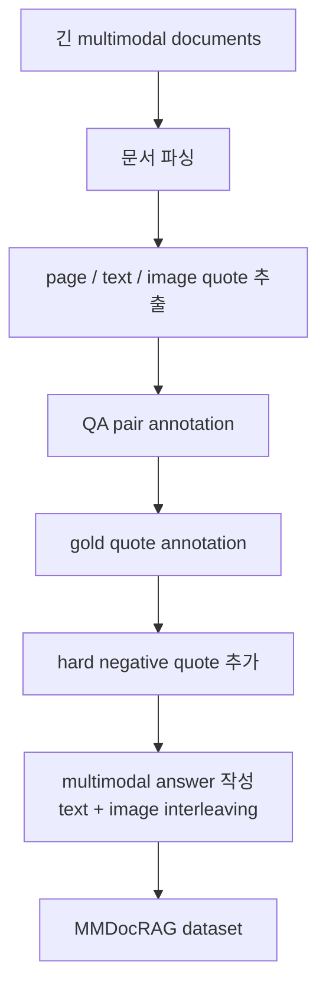
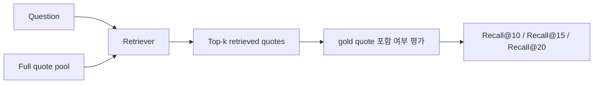
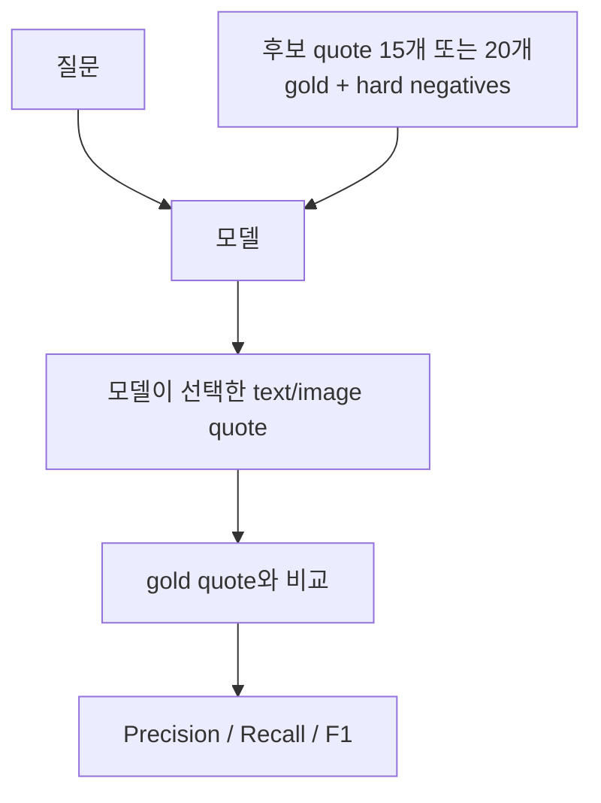
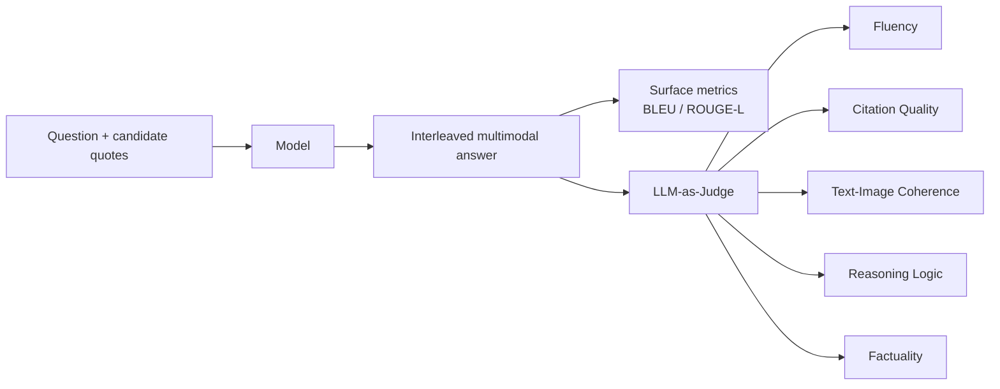
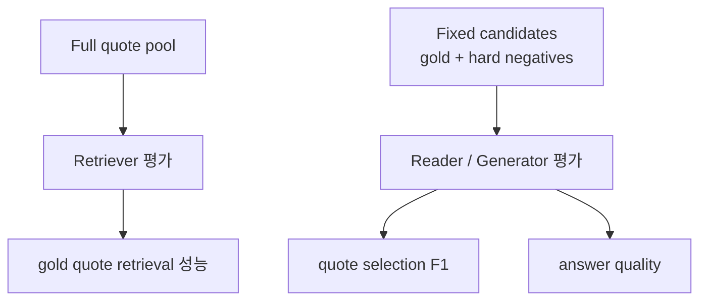

# MMDocRAG 한국어 상세 노트

원문: https://arxiv.org/abs/2505.16470  
HTML: https://ar5iv.labs.arxiv.org/html/2505.16470v2  
프로젝트: https://mmdocrag.github.io/MMDocRAG/  
작성일: 2026-04-29

주의: 이 파일은 논문 HTML 전체의 직역이 아니라, 논문 내용을 한국어로 재구성한 상세 해설 노트다. 원문 전체 번역이 필요한 경우에는 사용자가 제공한 PDF/HTML 파일을 기준으로 별도 작업해야 한다.

## 한 줄 요약

MMDocRAG은 긴 multimodal document에서 RAG를 평가하기 위한 벤치마크다. 문서를 text quote와 image quote로 나누고, gold quote와 hard negative quote를 섞은 후보에서 모델이 근거를 고르고 답을 생성하는 능력을 본다. 또한 별도로 retriever들이 gold quote를 잘 찾는지도 평가한다.

## 문제의식

기존 DocRAG는 텍스트 중심인 경우가 많아 차트, 표, 그림 같은 시각 정보를 놓치기 쉽다. 또한 기존 benchmark는 retrieved quote recall이나 텍스트 답변 품질만 보는 경우가 많아, 다음 능력을 충분히 평가하지 못한다.

- 시끄러운 후보 quote 안에서 진짜 multimodal evidence를 고르는 능력
- 텍스트와 이미지 근거를 함께 사용해 답을 구성하는 능력
- 답변 안에 이미지/표/차트 근거를 interleaved 형태로 연결하는 능력

MMDocRAG은 이런 문제를 직접 겨냥한다.

## 데이터셋 구성

| 항목 | 내용 |
|---|---|
| 문서 수 | 222개 |
| 평균 페이지 수 | 67페이지 |
| 평균 단어 수 | 약 33k words |
| QA 수 | 4,055개 |
| dev / eval split | 2,055 / 2,000 |
| cross-page 질문 | 2,107개, 52.0% |
| multi-image 질문 | 1,590개, 39.2% |
| evidence | text quote, image quote, page evidence |
| 답변 형태 | text-image interleaved answer |

## quote란 무엇인가

MMDocRAG은 문서를 그냥 페이지 단위로만 보지 않고 quote 단위로 다룬다.

| quote 종류 | 의미 |
|---|---|
| Text quote | 문서에서 잘라낸 텍스트 근거 조각 |
| Image quote | 표, 차트, 그림, 인포그래픽 등 시각 근거 조각 |
| Gold quote | 정답을 만들기 위해 실제로 필요한 근거 |
| Hard negative quote | 질문/정답과 유사하지만 실제 근거는 아닌 헷갈리는 조각 |

Hard negative는 질문 또는 정답과 텍스트/시각적으로 비슷하게 검색되는 quote 중에서 고른다. 목적은 모델이 그럴듯한 가짜 근거에 낚이는지 확인하는 것이다.

## 데이터 구성 파이프라인

## 평가 축 1: Retrieval 평가

Retriever 평가는 질문과 전체 quote pool이 있을 때, 검색기가 gold quote를 top-k 안에 잘 가져오는지를 본다.

논문은 6개 text retriever, 4개 visual retriever, 4개 hybrid retriever를 평가한다.

| retriever 유형 | 예 |
|---|---|
| Text | DPR, ColBERT, BGE, E5, Contriever, GTE |
| Visual | DSE, ColPali, ColQwen 등 |
| Hybrid | text retriever와 visual retriever 조합 |

이 결과는 "long document에서 gold quote를 검색해오는 것 자체가 어렵다"는 점을 보여준다.

## 평가 축 2: Quote Selection 평가

Quote selection 평가는 검색기가 직접 뽑은 결과가 아니라, 고정된 후보 quote 세트를 모델에 주고 그 안에서 gold quote를 고르게 하는 평가다.

후보 세트는 보통 15 quote 또는 20 quote로 구성된다. 15 quote 세팅은 5 image quotes와 10 text quotes, 20 quote 세팅은 8 image quotes와 12 text quotes처럼 나뉜다.

이 평가는 "retrieval 이후 generator/reader가 진짜 근거를 구분할 수 있는가"를 보는 controlled setting이다.

## 평가 축 3: Multimodal Answer Quality 평가

모델은 선택한 quote를 바탕으로 답변을 만든다. 답변은 텍스트만이 아니라 이미지/표/차트 근거를 함께 포함할 수 있다.

논문은 quote selection F1과 answer quality를 함께 보고, answer quality는 BLEU/ROUGE-L 같은 표면 유사도뿐 아니라 LLM-as-Judge 평가도 사용한다.

## fixed candidate quotes의 의미

MMDocRAG에서 generation 평가는 많은 경우 fixed candidate quotes를 사용한다. 즉 retriever가 매번 다르게 뽑은 top-k를 generator에 넣는 end-to-end 평가가 아니라, gold quote와 noisy quote가 섞인 고정 후보를 주고 모델의 근거 선택과 답변 생성을 평가한다.

따라서 MMDocRAG은 다음 세 가지 관점으로 나눠 읽어야 한다.

| 관점 | 실제 논문 평가 여부 | 설명 |
|---|---|---|
| Retrieval | 있음 | 전체 quote pool에서 gold quote를 top-k로 찾는지 평가 |
| Quote Selection | 있음 | 고정 후보 안에서 gold quote를 고르는지 평가 |
| Answer Quality | 있음 | 고정 후보 기반으로 생성한 multimodal answer 품질 평가 |
| Full end-to-end RAG | 메인 세팅은 아님 | 검색기가 뽑은 top-k를 그대로 generator에 넣는 전체 파이프라인 평가는 중심이 아님 |

## 우리 관점에서 읽는 법

| 질문 | 답 |
|---|---|
| RAG benchmark인가? | 맞다 |
| gold quote + hard negative를 주면 이미 retrieval 결과 아닌가? | 맞다. reader/generator controlled setting이다 |
| retriever 성능도 평가하나? | 따로 평가한다 |
| full end-to-end RAG인가? | 논문 메인 generation 평가는 fixed candidates 중심이다 |
| 무엇을 보기 좋은가? | retrieval, evidence selection, multimodal answer generation을 분리해서 분석하기 좋다 |

MMDocRAG은 실제 RAG 시스템을 분석할 때 가장 쓸모가 크다. 다만 점수를 읽을 때 "retriever 평가 점수"와 "fixed candidate 기반 generator 평가 점수"를 섞어 해석하면 안 된다.
