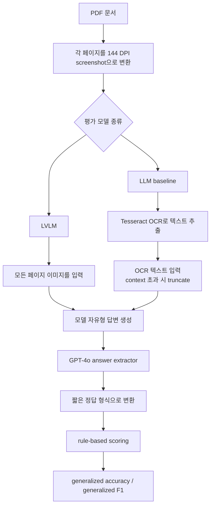
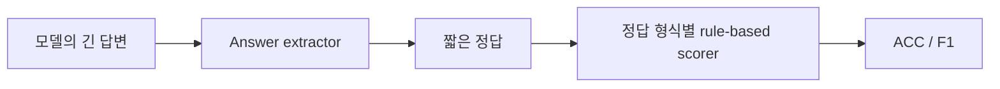

# MMLongBench-Doc 한국어 상세 노트

원문: https://arxiv.org/abs/2407.01523  
HTML: https://ar5iv.labs.arxiv.org/html/2407.01523v3  
작성일: 2026-04-29

주의: 이 파일은 논문 HTML 전체의 직역이 아니라, 논문 내용을 한국어로 재구성한 상세 해설 노트다. 원문 전체 번역이 필요한 경우에는 사용자가 제공한 PDF/HTML 파일을 기준으로 별도 작업해야 한다.

## 한 줄 요약

MMLongBench-Doc은 긴 PDF 문서를 페이지 이미지 또는 OCR 텍스트로 모델에 넣고, 모델이 긴 문서 안에서 필요한 근거를 찾아 질문에 답할 수 있는지를 평가하는 long-context multimodal document understanding 벤치마크다. RAG 검색기를 붙여 평가하는 데이터셋이라기보다는, 모델 자체가 긴 문서 전체를 컨텍스트로 처리할 수 있는지 보는 쪽에 가깝다.

## 문제의식

기존 DocVQA류 벤치마크는 대부분 한 페이지 또는 짧은 문서 중심이었다. 실제 업무 문서는 수십 페이지 이상이고, 표, 차트, 이미지, 레이아웃, 본문 텍스트가 섞여 있다. 이 경우 모델은 단순히 한 페이지를 읽는 것뿐 아니라 다음 능력이 필요하다.

- 긴 문서 안에서 필요한 페이지와 요소를 찾는 localization
- 여러 페이지에 흩어진 근거를 모아 답을 만드는 cross-page comprehension
- 문서에 답이 없는 경우 답이 없다고 말하는 hallucination 억제

MMLongBench-Doc은 이 세 능력을 함께 평가하려고 만들어졌다.

## 데이터셋 구성

| 항목 | 내용 |
|---|---|
| 문서 수 | 135개 PDF |
| 평균 페이지 수 | 47.5페이지 |
| 평균 텍스트 토큰 | 약 21,214개 |
| 질문 수 | 1,091개 |
| single-page 질문 | 485개, 44.5% |
| cross-page 질문 | 360개, 33.0% |
| unanswerable 질문 | 246개, 22.5% |
| evidence source | text, layout, table, chart, image |
| 문서 유형 | 연구 보고서, 재무 보고서, 논문, 브로슈어, 가이드라인, 행정/산업 문서, 튜토리얼/워크숍 등 |

## 질문 유형

| 유형 | 의미 | 평가하고 싶은 능력 |
|---|---|---|
| Single-page | 정답 근거가 한 페이지에 있음 | 긴 문서 안에서 해당 페이지를 찾는 능력 |
| Cross-page | 정답 근거가 여러 페이지에 흩어져 있음 | 여러 페이지 정보를 모아 추론하는 능력 |
| Unanswerable | 문서 안에 답이 없음 | 없는 답을 지어내지 않는 능력 |

## 평가 파이프라인

## 입력 방식 해석

핵심은 PDF 문서를 검색해서 일부만 넣는 것이 아니라, 가능한 한 전체 페이지를 모델에 넣는다는 점이다.

- GPT-4o, GPT-4V, Gemini-1.5-Pro 같은 proprietary LVLM에는 원본 페이지 screenshot들을 그대로 입력한다.
- 일부 모델은 너무 많은 이미지를 직접 받을 수 없기 때문에, 여러 페이지를 이어붙여 1개 또는 5개 이미지로 만든다.
- LLM baseline에는 OCR 텍스트를 넣는다.
- OCR 텍스트는 차트/이미지 정보가 손실되므로 논문은 이를 lossy document로 본다.

따라서 MMLongBench-Doc은 "RAG로 관련 chunk를 찾아 넣었을 때 성능"이 아니라 "긴 문서 전체를 넣었을 때 모델이 알아서 찾아 답하는 성능"에 가깝다.

## 점수 계산

모델은 자유롭게 답변한다. 이후 GPT-4o 기반 answer extractor가 답을 짧은 형식으로 뽑고, 정답 형식에 따라 rule-based scorer가 채점한다. 이 구조는 모델이 문서 이해를 했는지에 초점을 두기 위한 장치다.

## 실험 결과 감각

가장 강한 GPT-4o도 F1 44.9% 수준으로 보고되며, GPT-4V는 그보다 낮다. 많은 LVLM은 OCR 텍스트를 받은 LLM보다도 낮은 결과를 보인다. 논문이 말하려는 핵심은 현재 LVLM들이 긴 문서의 여러 페이지, 표, 차트, 이미지, 레이아웃을 안정적으로 다루기에는 아직 부족하다는 것이다.

## 우리 관점에서 읽는 법

| 질문 | 답 |
|---|---|
| RAG benchmark인가? | 아니다 |
| 문서를 통째로 넣는가? | 대체로 그렇다 |
| 검색기 성능을 평가하는가? | 아니다 |
| 무엇을 보기 좋은가? | long-context document understanding, multi-page reasoning, hallucination 억제 |

MMLongBench-Doc은 "우리 RAG retriever가 잘 찾는가"보다 "모델 자체가 긴 PDF를 한 번에 보고 필요한 정보를 찾을 수 있는가"를 볼 때 적합하다.
