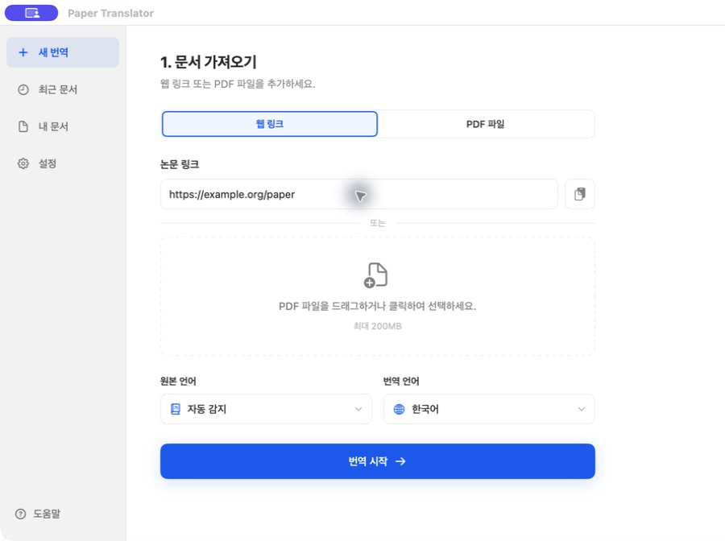
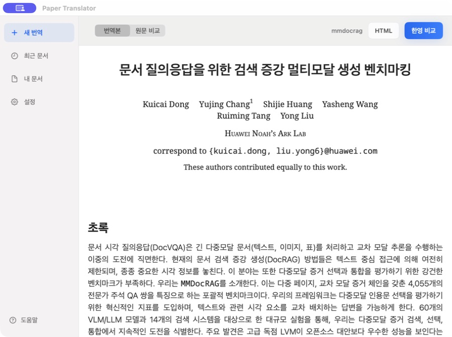
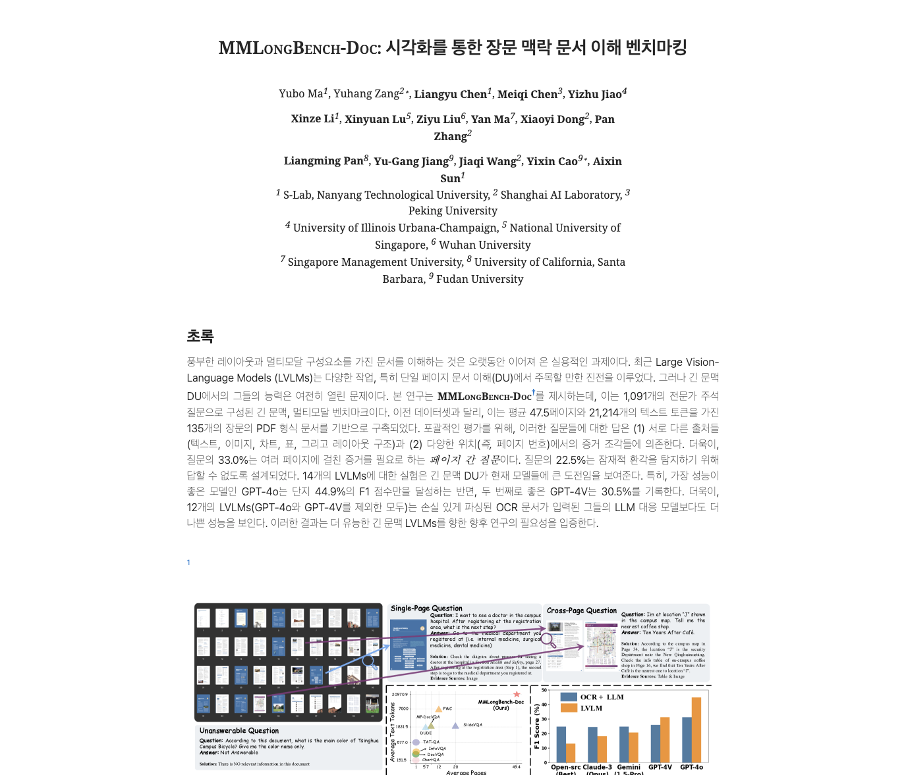
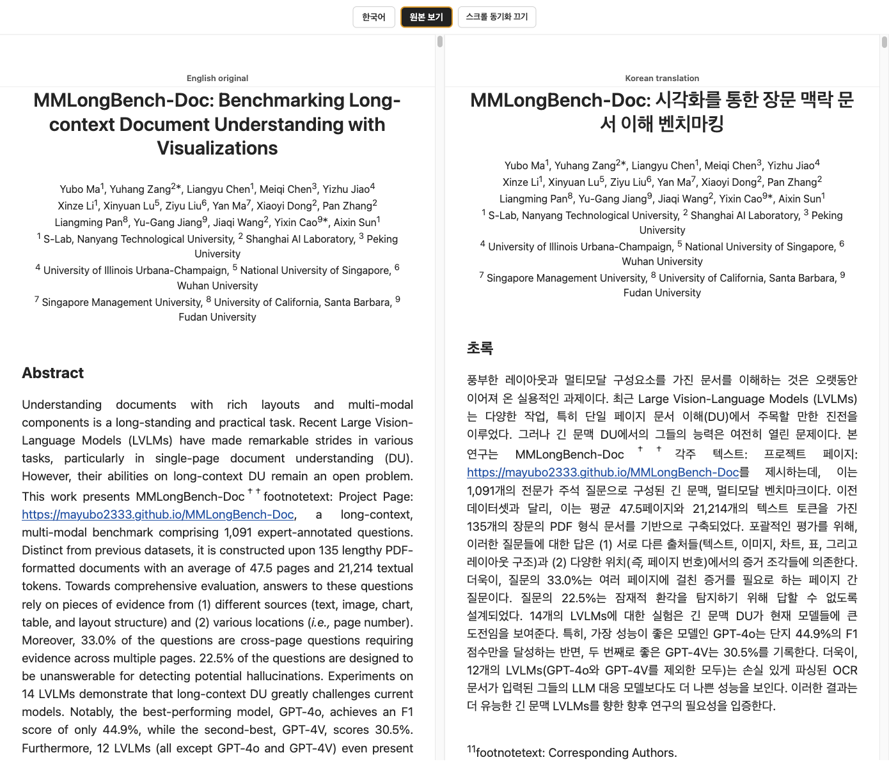

# 구조 보존 논문 번역기

[English](README.md) | [한국어](README.ko.md)

네이티브 macOS 작업 공간, ChatGPT/Codex 구독 로그인, OpenAI 호환 API를 지원하는 구조 보존형 한국어 논문 번역기입니다.

목표는 논문 요약이 아닙니다. 원문 논문의 구조와 읽는 흐름을 최대한 유지하면서, 본문 텍스트를 가능한 한 직역에 가깝게 번역하는 것이 목표입니다.

## 미리보기

네이티브 macOS 앱에서 arXiv/ar5iv 링크를 입력하거나 PDF를 끌어다 놓습니다.



문서 가져오기부터 구조 보존 번역 진행 상황, 최종 논문 읽기까지 하나의 작업 공간에서 처리합니다.

| 번역 진행 | 내장 논문 리더 |
| --- | --- |
|  |  |

생성된 HTML은 조용한 논문 리더처럼 보이도록 설계되어 있습니다. 그림과 표는 제자리에 남고, 인용과 링크는 유지되며, 번역된 본문은 한 줄씩 읽기 좋게 표시됩니다.

| 한국어 리더 | 영어/한국어 병행 리더 |
| --- | --- |
|  |  |

병행 출력에는 `원본 보기` 모드가 포함됩니다. 이 모드에서는 왼쪽에 영어 원문, 오른쪽에 한국어 번역이 표시됩니다. 스크롤 동기화는 기본으로 켜져 있으며, 필요할 때 끄고 양쪽 위치를 직접 맞춘 뒤 다시 켤 수 있습니다. 다시 켜는 순간 화면은 움직이지 않고, 그 상태를 기준으로 이후 스크롤부터 함께 움직입니다.

## 주요 기능

- PDF 파싱 대신 ar5iv HTML을 사용합니다.
- PDF만 있는 논문은 LiteParse 기반 `pdf-import`로 페이지 이미지와 텍스트 블록을 가진 source HTML로 먼저 변환할 수 있습니다.
- 모델 호출 전에 HTML 태그를 마스킹하고, 번역 후 같은 태그를 복원합니다.
- 번역 가능한 텍스트 블록만 모델에 보냅니다.
- `figure.ltx_table` 표 HTML은 모델에 보내지 않고 원본 그대로 유지해 토큰을 절약하고 표 깨짐을 줄입니다.
- 링크, 인용, 그림, 수식, 코드/pre/math 블록, 문서 구조를 보존합니다.
- 흰 배경, 중앙 정렬, 읽기 좋은 타이포그래피를 가진 논문 리더 스타일을 적용합니다.
- 한국어 단독 HTML과 영어/한국어 병행 HTML을 모두 생성합니다.
- 병행 리더에서 선택 가능한 스크롤 동기화를 제공합니다.
- JSONL 캐시를 작성해 중단된 번역 작업을 이어서 실행할 수 있습니다.
- 링크/PDF 가져오기, 실시간 진행 상황, 결과 읽기를 제공하는 네이티브 SwiftUI macOS 앱을 포함합니다.
- OAuth 토큰을 앱에 복사하지 않고 ChatGPT/Codex 구독 인증을 사용할 수 있습니다.
- OpenAI 호환 API 키와 사용자 지정 Base URL 방식도 별도 provider로 유지합니다.

## 에이전트 바로 사용

이 레포지토리에는 코딩 에이전트용 설명서가 포함되어 있습니다. Codex, Claude Code 같은 에이전트에게 이 레포 주소를 전달한 뒤 다음 파일을 읽게 하면 바로 작업을 시작할 수 있습니다.

- `AGENTS.md`: 전체 에이전트 작업 가이드
- `CLAUDE.md`: Claude Code 전용 기본 지침
- `skills/paper-structure-translator/SKILL.md`: 재사용 가능한 skill 형식 지침

## 설정

먼저 로컬 런타임을 설치합니다.

```bash
uv sync
```

그다음 인증 방식 하나를 선택합니다.

### 방법 A: ChatGPT / Codex 구독

Codex CLI를 설치한 뒤 앱 설정 화면에서 ChatGPT로 로그인하거나 다음 명령을 사용합니다.

```bash
codex login
codex login status
```

로그인, 자격증명 저장, 토큰 갱신은 Codex에 위임합니다. Paper Translator는 OAuth 토큰을 직접 읽거나 저장하지 않습니다. 설정에서 `ChatGPT / Codex 구독`을 선택한 뒤 모델을 고릅니다.

CLI에서도 같은 provider를 사용할 수 있습니다.

```bash
./paper-translator translate \
  --paper-id mmdocrag \
  --provider codex \
  --model gpt-5.4-mini
```

### 방법 B: OpenAI 호환 API

로컬 환경 파일을 만듭니다.

```bash
cp .env.example .env
```

로컬 `.env`를 채웁니다.

```bash
OPENAI_API_KEY=...
OPENAI_BASE_URL=http://host:port/v1
```

`.env`, 다운로드한 소스, 캐시, 생성된 HTML 출력물은 git에서 무시됩니다.

macOS 앱에서는 `OpenAI 호환 API`를 선택해 OpenAI Base URL과 모델을 바꾸거나 API 키를 임시로 입력할 수 있습니다. 덮어쓰기 입력칸을 비워두면 해당 `.env` 값을 사용합니다.

## 빠른 시작

OpenAI 호환 API provider를 사용할 때는 먼저 로컬 환경을 확인합니다.

```bash
./paper-translator doctor
```

명시적인 CLI 플래그로 소스 HTML을 가져옵니다.

```bash
./paper-translator fetch \
  --paper-id mmdocrag \
  --source-url https://ar5iv.labs.arxiv.org/html/2505.16470v2
```

모든 명령은 에이전트가 읽기 좋은 JSON 출력을 지원합니다.

```bash
./paper-translator doctor --json
```

모델을 호출하기 전에 드라이런으로 블록 수를 확인합니다.

```bash
./paper-translator translate \
  --paper-id mmdocrag \
  --dry-run
```

그다음 실제 번역을 실행합니다. 기본 provider는 `api`이며, 로그인된 ChatGPT/Codex 구독을 쓰려면 `--provider codex`를 전달합니다.

```bash
./paper-translator translate --paper-id mmdocrag
```

출력 파일은 다음과 같습니다.

```text
outputs/mmdocrag.ko.paper.html
outputs/mmdocrag.ko-en.paper.html
```

`*.ko.paper.html`은 한국어 단독 리더입니다.  
`*.ko-en.paper.html`은 처음에는 한국어 단독 보기로 열립니다. `원본 보기`를 클릭하면 왼쪽 영어, 오른쪽 한국어의 2열 병행 리더로 전환됩니다.

## macOS 앱

이 레포에는 로컬 데스크톱용 네이티브 SwiftUI 작업 공간이 포함되어 있습니다. 인터페이스와 내장 리더는 macOS 네이티브 구성 요소를 사용하고, 번역 엔진은 `./paper-translator`와 같은 `uv` 관리 Python 파이프라인으로 실행됩니다.

앱 런타임은 다음 명령으로 준비합니다.

```bash
uv sync
```

앱 밖의 스크립팅을 위해 독립 `.venv`가 필요할 때는 다음 명령도 계속 사용할 수 있습니다.

```bash
./scripts/bootstrap_python_env.sh
```

앱 번들을 빌드합니다.

```bash
./scripts/build_macos_app.sh
```

번들은 다음 위치에 생성됩니다.

```text
dist/Paper Translator.app
```

앱에서 할 수 있는 일:

- arXiv/ar5iv 링크를 붙여넣거나 로컬 PDF를 드래그 앤 드롭합니다.
- 문서 가져오기, 구조 분석, 번역, 리더 스타일 적용 단계를 구분해 확인합니다.
- 그림, 표, 수식, 인용의 보존 상태를 확인합니다.
- 한국어 번역본을 읽거나 영어/한국어 비교 보기로 전환합니다.
- 생성된 HTML 또는 2열 병행 리더를 엽니다.
- ChatGPT/Codex 구독과 OpenAI 호환 API 중 인증 방식을 선택합니다.
- GPT-5.6 Sol, Terra, Luna 또는 설정된 다른 모델을 선택합니다.

앱은 레포에서 실행될 때 이 레포 경로를 자동 감지하며, 설정에서 프로젝트 경로를 수정할 수 있습니다.

### 설정의 Codex OAuth


`ChatGPT / Codex 구독`은 로컬에 설치된 Codex 런타임을 사용합니다. `ChatGPT로 로그인`은 Codex가 관리하는 브라우저 로그인을 열고, `상태 확인`은 Paper Translator에 토큰을 노출하지 않은 채 현재 계정을 확인합니다. 구현은 [Codex app-server 프로토콜](https://github.com/openai/codex/blob/main/codex-rs/app-server/README.md)에 설명된 관리형 인증 경계를 따릅니다.

## 다른 논문 번역하기

새 ar5iv URL을 CLI에 직접 넘깁니다. `--paper-id`를 기준으로 입력, 출력, 캐시, 병행 출력 경로가 자동으로 정해집니다.

```bash
./paper-translator translate \
  --paper-id your-paper \
  --source-url https://ar5iv.labs.arxiv.org/html/... \
  --dry-run
```

블록 수가 괜찮아 보이면 `--dry-run`을 제거하고 실행합니다.

## PDF만 있는 논문

ar5iv HTML이 없고 PDF만 있는 문서는 먼저 PDF를 source HTML로 가져옵니다. PDF 가져오기는 Python `liteparse` 패키지가 필요합니다.

```bash
uv add liteparse
```

에이전트에서 LiteParse skill 지침도 쓰려면 다음 명령으로 추가할 수 있습니다.

```bash
npx skills add run-llama/llamaparse-agent-skills --skill liteparse
```

Hugging Face의 `/blob/...` PDF URL은 자동으로 `/resolve/...` 원본 PDF URL로 정규화됩니다.

```bash
./paper-translator pdf-import \
  --paper-id deepseek-v4 \
  --pdf-url https://huggingface.co/deepseek-ai/DeepSeek-V4-Pro/blob/main/DeepSeek_V4.pdf \
  --title "DeepSeek V4" \
  --json
```

생성되는 파일은 다음과 같습니다.

```text
inputs/pdfs/deepseek-v4.pdf
inputs/assets/deepseek-v4/page-0001.png
inputs/deepseek-v4.source.html
```

그다음 기존 번역 명령을 그대로 사용합니다.

```bash
./paper-translator translate --paper-id deepseek-v4 --dry-run
./paper-translator translate --paper-id deepseek-v4
```

PDF 경로는 ar5iv HTML보다 구조 복원력이 낮습니다. 대신 LiteParse로 원본 페이지 스크린샷을 함께 보존하므로 그림, 수식, 표는 페이지 이미지에서 확인하고, 추출된 텍스트 블록을 번역하는 방식으로 읽을 수 있습니다.

## 리더 스타일 재적용 또는 표 복원

이미 번역된 HTML이 있고, 리더 CSS를 새로 적용하거나 원본 표를 다시 복원하고 싶다면 다음 명령을 사용합니다.

```bash
./paper-translator restyle --paper-id mmdocrag
```

## 스크립트

- `paper-translator`: `uv`를 통해 `scripts/paper_translator.py`를 실행하는 CLI 래퍼입니다.
- `scripts/paper_translator.py`: `doctor`, `fetch`, `translate`, `restyle`, `serve`를 제공하는 에이전트 친화 CLI입니다.
- `scripts/translate_html_blocks.py`: 태그를 마스킹하고, 텍스트 블록을 번역하고, 태그를 복원한 뒤 논문 리더 HTML을 작성합니다.
- `scripts/codex_translation_schema.json`: Codex 구독 번역 배치가 결정적인 `{id, text}` JSON 결과를 반환하도록 제한합니다.
- `scripts/apply_paper_viewer_style.py`: 리더 CSS를 다시 적용하고, ar5iv asset 링크를 고치며, 선택적으로 원본 표 HTML을 복원합니다.
- `scripts/bootstrap_python_env.sh`: `uv` 없이 `.venv`를 만들고 Python 런타임 의존성을 설치합니다.
- `scripts/build_macos_app.sh`: SwiftUI 데스크톱 래퍼를 `dist/Paper Translator.app`으로 빌드합니다.

## 참고

번역할 권리가 있는 문서에 사용하세요. 전체 번역 논문 출력물은 재배포가 허용된 경우가 아니라면 로컬에 보관하는 것이 좋습니다.
