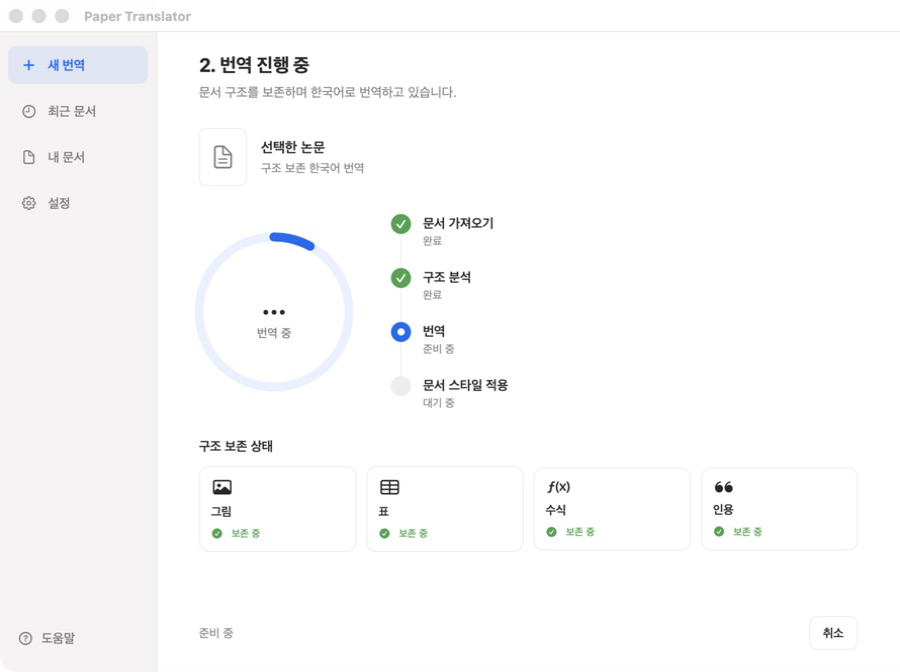
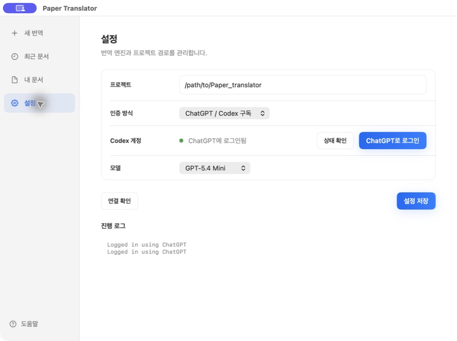

# KPaper

[English](README.md) | [한국어](README.ko.md)

Read papers in Korean without losing their original structure. KPaper includes a native macOS workspace, ChatGPT/Codex subscription sign-in, and OpenAI-compatible API support.

The goal is not to summarize a paper. The goal is to keep the paper readable like a normal article page while translating the body text as literally as possible.

## Preview

Import an arXiv/ar5iv link or drop a PDF into the native macOS app.


The app keeps the full workflow in one place: document import, structure-preserving translation progress, and the final paper reader.

| Translation progress | Built-in paper reader |
| --- | --- |
|  |  |

The generated HTML is designed as a quiet paper reader: figures and tables stay in place, citations remain clickable, and the translated body text remains easy to read line by line.

| Korean reader | English/Korean parallel reader |
| --- | --- |
|  |  |

The bilingual output includes an `원본 보기` mode with English on the left and Korean on the right. Scroll sync is enabled by default, but you can turn it off, adjust either side manually, then turn it back on without moving the current view. Future scrolls continue in sync from that state.

## Features

- Uses ar5iv HTML instead of PDF parsing.
- Converts PDF-only papers into reading-order HTML with inline table, chart, and figure crops using Unlimited-OCR MXFP8 grounding.
- Masks HTML tags before calling the model, then restores the exact tags after translation.
- Sends only translatable text blocks to the model.
- Keeps `figure.ltx_table` table HTML unchanged to save tokens and avoid breaking tables.
- Preserves links, citations, figures, equations, code/pre/math blocks, and document structure.
- Adds a clean paper-viewer style: centered white page, white background, readable typography.
- Writes Korean-only HTML and bilingual English/Korean HTML.
- Provides a two-column bilingual reader with optional scroll sync.
- Writes JSONL caches so interrupted runs can resume.
- Includes a native SwiftUI macOS workspace for link/PDF import, live progress, and reading outputs.
- Supports ChatGPT/Codex subscription authentication without copying OAuth tokens into the app.
- Keeps OpenAI-compatible API key and custom base URL support as a separate provider.

## Agent Ready

This repository includes instructions for coding agents. If you are using Codex, Claude Code, or a similar agent, give it this repository URL and point it to:

- `AGENTS.md` for the full agent operating guide.
- `CLAUDE.md` for Claude Code-specific defaults.
- `skills/kpaper/SKILL.md` for reusable skill-style instructions.

## Setup

Install the local runtime first:

```bash
uv sync
```

Then choose one authentication method.

### Option A: ChatGPT / Codex Subscription

Install the Codex CLI, then sign in with ChatGPT from the app Settings screen or with:

```bash
codex login
codex login status
```

The app delegates login, credential storage, and refresh to Codex. It does not read or persist the OAuth tokens itself. Select `ChatGPT / Codex subscription` in Settings, then choose a model.

The same provider is available from the CLI:

```bash
./kpaper translate \
  --paper-id mmdocrag \
  --provider codex \
  --model gpt-5.4-mini
```

### Option B: OpenAI-Compatible API

Create the local environment file:

```bash
cp .env.example .env
```

Fill `.env` locally:

```bash
OPENAI_API_KEY=...
OPENAI_BASE_URL=http://host:port/v1
```

`.env`, downloaded sources, caches, and generated HTML outputs are ignored by git.

In the macOS app, select `OpenAI-compatible API` to edit the OpenAI Base URL, choose a model, or temporarily enter an API key. Leaving an override empty uses the corresponding `.env` value.

## Quick Start

For the OpenAI-compatible API provider, check the local environment:

```bash
./kpaper doctor
```

Fetch source HTML with explicit CLI flags:

```bash
./kpaper fetch \
  --paper-id mmdocrag \
  --source-url https://ar5iv.labs.arxiv.org/html/2505.16470v2
```

Agent-friendly JSON output is available on every command:

```bash
./kpaper doctor --json
```

Run a dry run to inspect block counts before calling the model:

```bash
./kpaper translate \
  --paper-id mmdocrag \
  --dry-run
```

Then run the translation. The default provider is `api`; pass `--provider codex` to use the signed-in ChatGPT/Codex subscription instead.

```bash
./kpaper translate --paper-id mmdocrag
```

The output files are:

```text
outputs/mmdocrag.ko.paper.html
outputs/mmdocrag.ko-en.paper.html
```

`*.ko.paper.html` is the Korean-only viewer.  
`*.ko-en.paper.html` starts with a Korean-only view. Click `원본 보기` to switch to a two-column reader with English on the left and Korean on the right.

## macOS App

This repo includes a native SwiftUI workspace for local desktop use. The interface and built-in reader are native macOS components, while translation runs through the same `uv`-managed Python pipeline used by `./kpaper`.

Prepare the app runtime with:

```bash
uv sync
```

If you specifically need a standalone `.venv` for scripting outside the app, you can still run:

```bash
./scripts/bootstrap_python_env.sh
```

Build the app bundle:

```bash
./scripts/build_macos_app.sh
```

The bundle is written to:

```text
dist/KPaper.app
```

In the app you can:

- Paste an arXiv/ar5iv link or drag and drop a local PDF.
- Follow import, structure analysis, translation, and viewer styling as distinct progress steps.
- Monitor preservation status for figures, tables, equations, and citations.
- Read the Korean output or switch to the English/Korean comparison view.
- Open the generated HTML or the two-column bilingual reader.
- Choose between a ChatGPT/Codex subscription and an OpenAI-compatible API.
- Select GPT-5.6 Sol, Terra, Luna, or another configured model.

The app auto-detects this repository when launched from the repo, and you can edit the project path in Settings.

### Codex OAuth in Settings



`ChatGPT / Codex subscription` uses the locally installed Codex runtime. `ChatGPT로 로그인` opens the Codex-managed browser login, and `상태 확인` verifies the current account without exposing tokens to KPaper. The implementation follows the managed authentication boundary documented by the [Codex app-server protocol](https://github.com/openai/codex/blob/main/codex-rs/app-server/README.md).

## Translate Another Paper

Pass a new ar5iv URL directly to the CLI. It will derive the default input, output, cache, and bilingual output paths from `--paper-id`.

```bash
./kpaper translate \
  --paper-id your-paper \
  --source-url https://ar5iv.labs.arxiv.org/html/... \
  --dry-run
```

Remove `--dry-run` when the block count looks right.

## PDF-Only Papers

If a paper has no ar5iv HTML and only ships as a PDF, import the PDF into source HTML first. On Apple Silicon, the default layout backend uses `sahilchachra/unlimited-ocr-mxfp8-mlx` page by page to recover reading order and grounded block boxes.

```bash
uv sync
```

Agents can also add the LiteParse skill instructions with:

```bash
npx skills add run-llama/llamaparse-agent-skills --skill liteparse
```

Hugging Face `/blob/...` PDF URLs are normalized to the raw `/resolve/...` PDF URL automatically.

```bash
./kpaper pdf-import \
  --paper-id deepseek-v4 \
  --pdf-url https://huggingface.co/deepseek-ai/DeepSeek-V4-Pro/blob/main/DeepSeek_V4.pdf \
  --title "DeepSeek V4" \
  --json
```

This writes:

```text
inputs/pdfs/deepseek-v4.pdf
inputs/assets/deepseek-v4/page-0001.png
inputs/deepseek-v4.source.html
```

Then use the normal translation command:

```bash
./kpaper translate --paper-id deepseek-v4 --dry-run
./kpaper translate --paper-id deepseek-v4
```

The layout backend reflows text in model reading order and crops detected tables, charts, and figures from the original page between surrounding text blocks. It also keeps page screenshots under `inputs/assets/` as a source-of-truth fallback.

To select the model explicitly:

```bash
uv sync
./kpaper pdf-import \
  --paper-id scanned-paper \
  --pdf scan.pdf \
  --layout-backend unlimited-ocr-mlx \
  --layout-model sahilchachra/unlimited-ocr-mxfp8-mlx
```

Use `--layout-backend native` for fast PyMuPDF geometry on born-digital PDFs, or `--layout-backend liteparse` for the old full-page-image fallback.

## Re-apply Viewer Style or Restore Tables

If you already have translated HTML and only want to refresh the viewer CSS or restore source tables:

```bash
./kpaper restyle --paper-id mmdocrag
```

## Scripts

- `kpaper`: CLI wrapper that runs `scripts/kpaper.py` through `uv`.
- `scripts/kpaper.py`: agent-aware CLI for `doctor`, `fetch`, `translate`, `restyle`, and `serve`.
- `scripts/translate_html_blocks.py`: masks tags, translates text blocks, restores tags, writes paper-viewer HTML.
- `scripts/codex_translation_schema.json`: constrains Codex subscription translation batches to deterministic `{id, text}` JSON output.
- `scripts/apply_paper_viewer_style.py`: reapplies viewer CSS, fixes ar5iv asset links, optionally restores original table HTML.
- `scripts/bootstrap_python_env.sh`: creates `.venv` without `uv` and installs runtime Python dependencies.
- `scripts/build_macos_app.sh`: builds the SwiftUI desktop wrapper into `dist/KPaper.app`.

## Notes

Use this for documents you have the right to translate. Full translated paper outputs should stay local unless redistribution is permitted.
