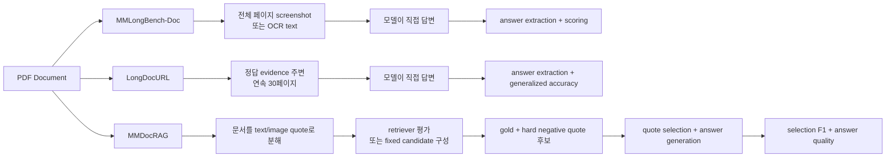

# MMLongBench-Doc / LongDocURL / MMDocRAG 평가방식 비교 노트

작성일: 2026-04-29  
대상:

- MMLongBench-Doc: https://arxiv.org/abs/2407.01523
- LongDocURL: https://arxiv.org/abs/2412.18424
- MMDocRAG: https://arxiv.org/abs/2505.16470

이 파일은 세 논문의 한국어 상세 노트를 함께 읽기 위한 비교 인덱스다.

## 가장 중요한 차이

| 벤치마크 | 모델 입력 | RAG 평가인가 | 핵심 평가 대상 |
|---|---|---|---|
| MMLongBench-Doc | PDF 전체 페이지 이미지 또는 OCR 텍스트 | 아님 | 긴 문서 전체 이해, cross-page QA, hallucination |
| LongDocURL | evidence 주변 연속 30페이지 또는 파싱 텍스트 | 아님 | understanding, reasoning, locating |
| MMDocRAG | gold + hard negative quote 후보 또는 전체 quote pool | 맞음 | retrieval, quote selection, multimodal answer generation |

## 세 데이터셋의 평가 흐름

## 질문별 답

### 1. 그냥 user context에 이어붙여서 문답하는가?

MMLongBench-Doc은 여기에 가장 가깝다. PDF 페이지 screenshot들을 모두 넣거나, OCR 텍스트를 넣는다. LongDocURL은 전체 문서가 아니라 evidence 주변 30페이지를 넣는다는 점에서 약간 다르다.

### 2. RAG를 붙여서 쿼리하고 답변하는가?

MMDocRAG이 여기에 가장 가깝다. 다만 generation 평가는 gold quote와 hard negative quote가 섞인 fixed candidate context를 쓰는 경우가 중심이다. 그래서 완전한 end-to-end RAG와는 구분해야 한다.

### 3. gold quote와 hard negative quote를 주면 이미 retrieval 결과 아닌가?

맞다. gold + hard negative quote 후보를 주는 세팅은 retriever 이후 reader/generator를 평가하는 controlled setting이다. retriever 성능은 별도로 전체 quote pool에서 gold quote를 찾는 방식으로 평가한다.

## 실험 설계에 가져다 쓰는 법

| 내가 보고 싶은 것 | 추천 벤치마크 |
|---|---|
| 모델이 긴 문서를 통째로 읽을 수 있는가 | MMLongBench-Doc |
| 관련 페이지 묶음을 줬을 때 구조/수치/위치 추론이 되는가 | LongDocURL |
| retriever가 gold evidence를 찾는가 | MMDocRAG retrieval 평가 |
| generator가 헷갈리는 후보 중 진짜 근거를 고르는가 | MMDocRAG quote selection 평가 |
| multimodal 근거로 답변을 잘 구성하는가 | MMDocRAG answer quality 평가 |

## 관련 파일

- ./MMLongBench-Doc_ko_note.md
- ./LongDocURL_ko_note.md
- ./MMDocRAG_ko_note.md
